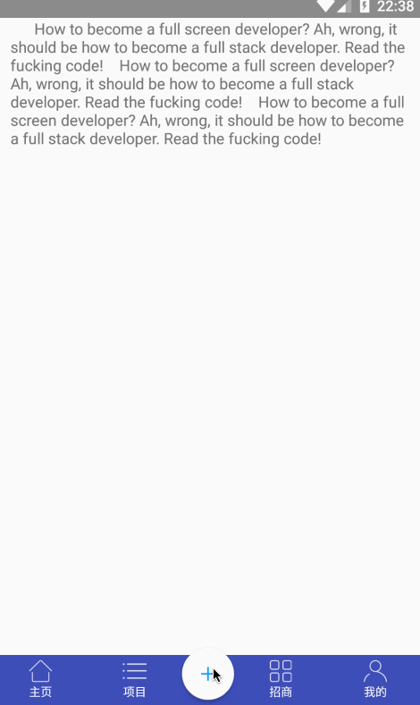
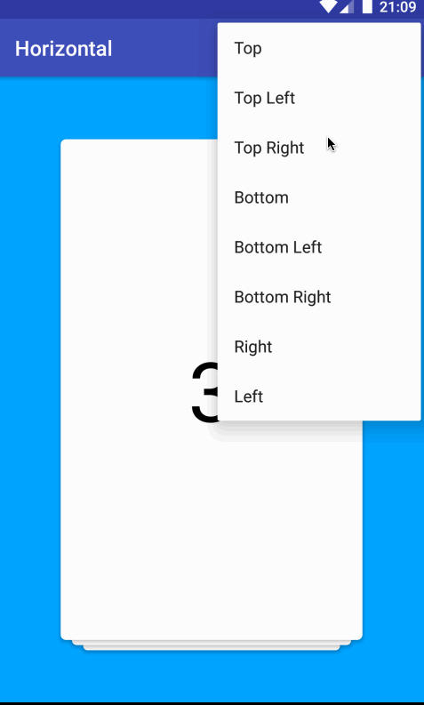
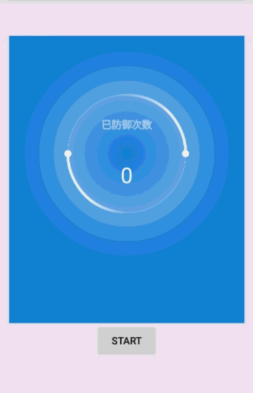

# Android_UE
Android  UE 效果的实现

## 
[高斯模糊的菜单效果图](https://github.com/aohanyao/Android_UE/tree/master/BlurMenu)

## [CardSwipeConcept 画廊卡片](https://github.com/aohanyao/CardSwipeConcept)

## [ViewPagerCardTransformer 各个方向的ViewPager](https://github.com/aohanyao/ViewPagerCardTransformer)

## [HorizontalLoopView 水平滑动的View](https://github.com/aohanyao/HorizontalLoopView)

## [BouncingJellyView 仿MIUI果冻视图](https://github.com/aohanyao/BouncingJelly)

## [SafeView 源码地址](https://github.com/aohanyao/SafeView)

